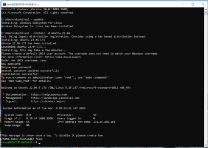
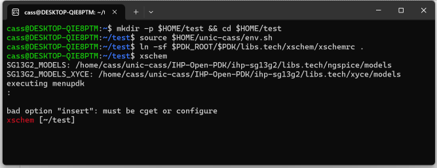
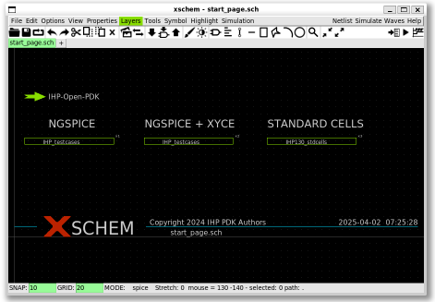

{: .no_toc }
# 1. Tools and PDK Installation

{: .no_toc }

<!-- <details open markdown="block">
  <summary>
    Table of contents
  </summary>
  {: .text-delta }
- TOC
{:toc}
</details> -->

This section introduces the basic tools and IHP SG13 PDK installation on Ubuntu 22.04 LTS in WSL.

## 1.0. Requirement

- Windows 10/11 with WSL 2.0.

## 1.1. Install Ubuntu 22.04 through WSL

- Run the following command in the Windows Command Prompt:

```sh
$ wsl --update
$ wsl --install -d ubuntu-22.04
```


- During the installation, it will ask for a username and password. Enter your username, type and retype the password (the characters you typed will not be shown).

- If the installation successes, you will be in a WSL Ubuntu 22.04 session.

## 1.2. Install Tools and PDK

- Run the following commands in Ubuntu 22.04 to automatically install the tools and IHP SG130 PDK:

```sh
$ wget https://gist.githubusercontent.com/duyhieubui/8acc0c43113360955c87877c626c7101/raw/9d5508963d69194422a9574adec820c8f5d4789e/ihp-open-pdk-setup-ubuntu-22.04.sh  -O ./ihp-open-pdk-setup-ubuntu-22.04.sh
$ bash ./ihp-open-pdk-setup-ubuntu-22.04.sh
```



- Test the installations:

```sh
$ mkdir -p $HOME/test && cd $HOME/test
$ source $HOME/unic-cass/env.sh
$ ln -sf $PDK_ROOT/$PDK/libs.tech/xschem/xschemrc .
$ xschem
```

- You should see the example from IHP Open PDK.



### Note

Support tools in the current installtion:

- Xschem 3.4.5 (schematic capture)

- Ngspice 43 (spice simulator)

- Xschem-gaw (waveform viewer for xschem)

- Yosys 0.51 (synthesis) + simulation/verification tools 

- Magic 8.3.508 (layout + extraction tools)

- OpenVAF v23.5.0 (Verilog-A compiler)

- Openroad v2.0 (place & route)

- Klayout 0.29.1 (layout + DRC + LVS)


