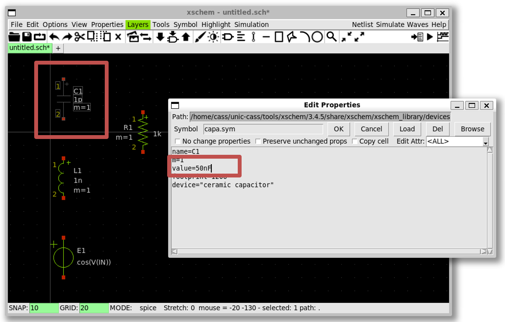
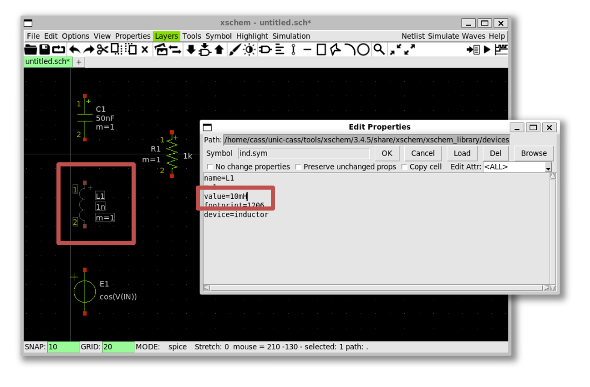
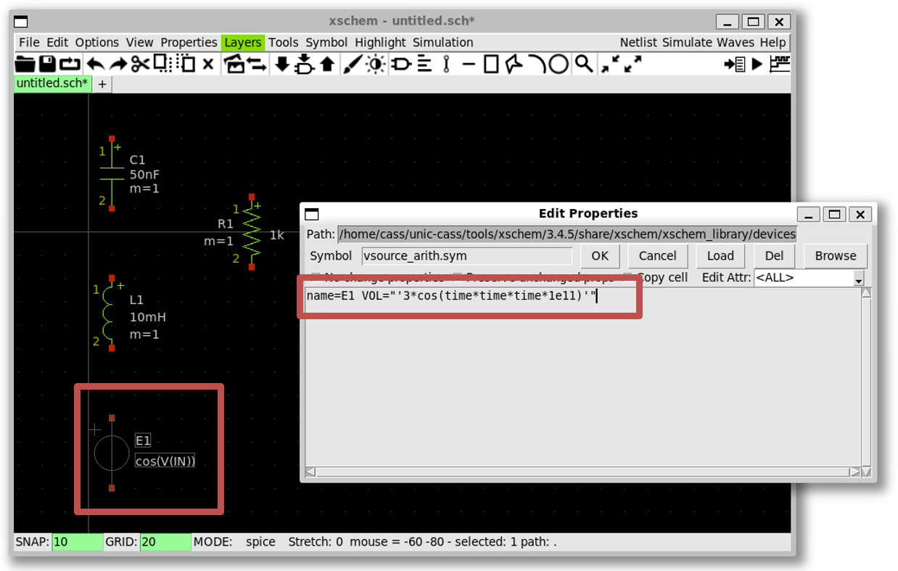
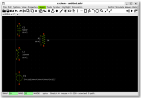
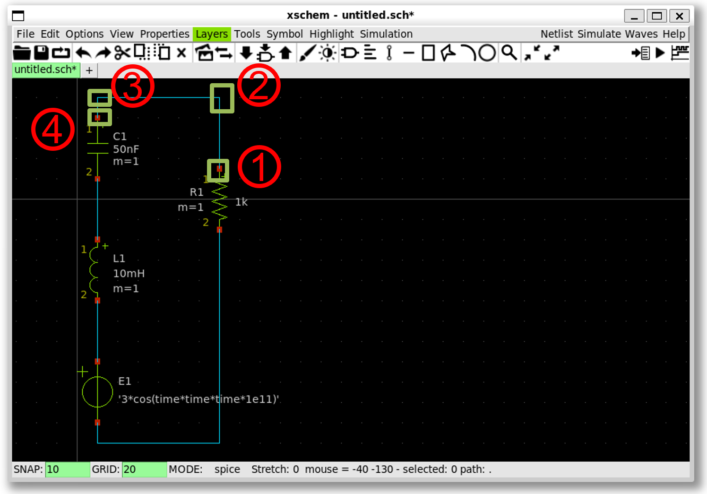
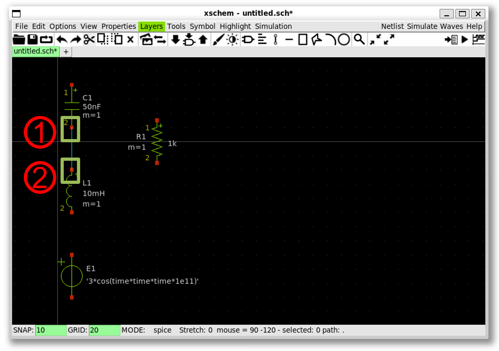

{: .no_toc }
# 2. Xscheme and NGSpice Demonstration

{: .no_toc }

<!-- <details open markdown="block">
  <summary>
    Table of contents
  </summary>
  {: .text-delta }
- TOC
{:toc}
</details> -->

This section demonstrates the usage of Xschem and NGSpice opensource tools.

## 2.1. Run Xscheme

- Open a Ubuntu 22.04 terminal and run the following commands (assuming that you already installed the tools):


```sh
$ source $HOME/unic-cass/env.sh
$ xschem
```

- The window pops up successfully as follows.


### Source

- [Xscheme Tutorial](https://xschem.sourceforge.io/stefan/xschem_man/tutorial_run_simulation.html).


## 2.2. Schematic capture - Create instances

Draw a RLC circuit in Xscheme:

- Create a new instance by selecting `Tools` >> `Insert Symbol` ``(Shift + i)``


- Create a resistor by `xscheme_library/devices` >> `res.sym` >> `OK` >> Click on the schematic windows


- Create an inductor (``ind.sym``)


- Create a capacitor (``capa.sym``)


- Create an arithmetic source (``vsource_arith.sym``)


## 2.3. Schematic capture - Change the paramters

Change the capacitance to 50nF and the inductance to 10mH

- Click on the `capacitor` and press `q`; change the value of `C1` to `50nF` then press `OK`



- Click on the `inductor` and press `q`; change the value of `L1` to `10mH` then press `OK`



Set the voltage source

- Click on the `voltage source` and press `q`; change the value of `E1` to `" '3*cos(time*time*time*1e11)' "` then press `OK` (note the single and doulbe quotes)



Final view



## 2.4. Schematic capture - Wiring

To connect the wire, press `w` then use the left-mouse click to create multiple wire segments



- 1. Put the cursor to the red point, then press `w`

- 2. Move the cursor here and left-mouse click, then press `w` again

- 3. Move the cursor here and left-mouse click, then press `w` again

- 4. Move the cursor here and left-mouse click on the red point to finish wiring



- 1. Put the cursor to the red point, then press `w`

- 2. Move the cursor to the red point, then left-mouse click

