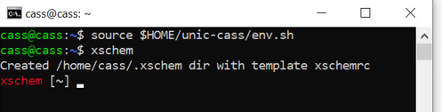
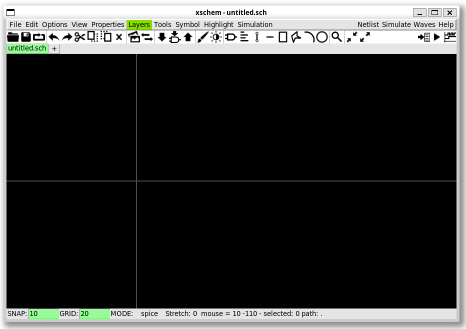
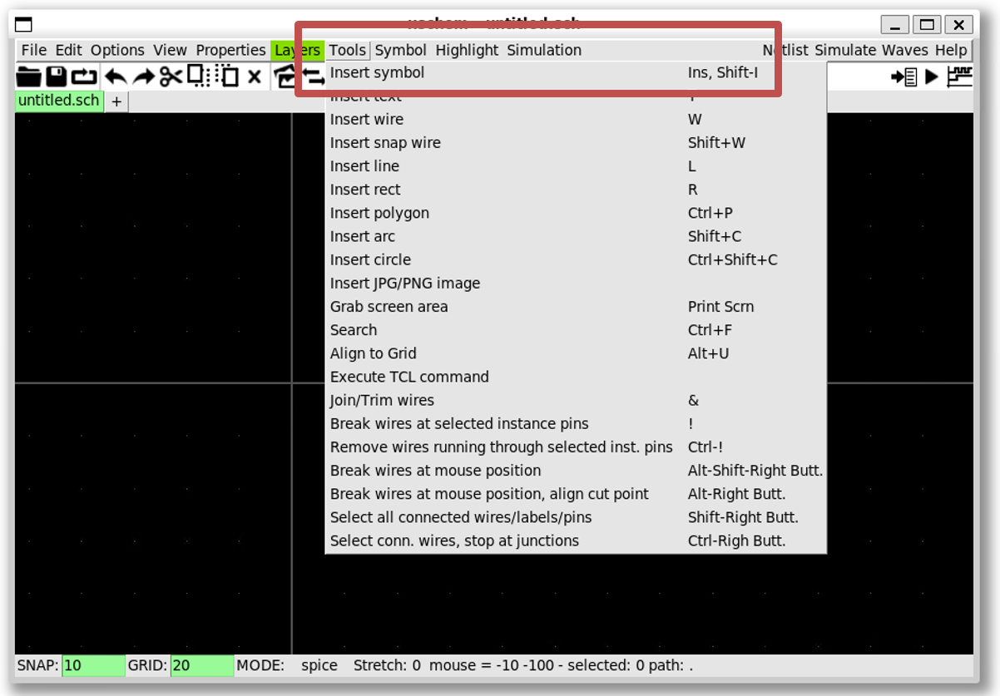
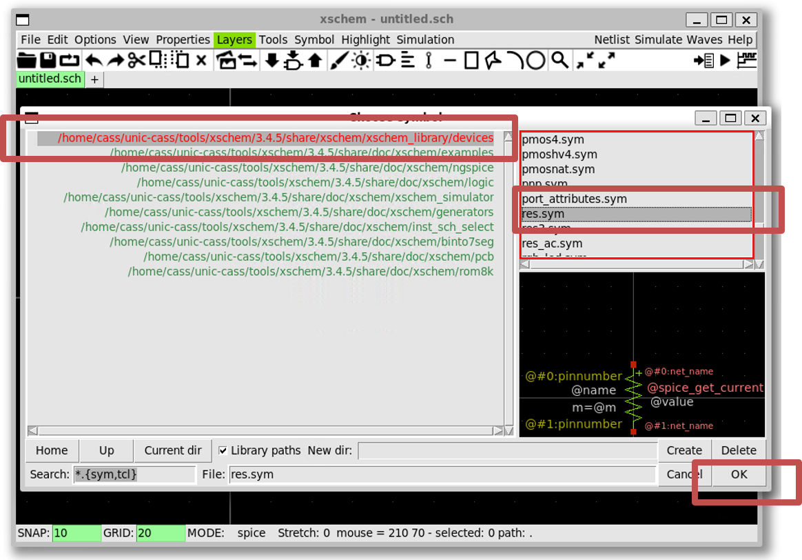
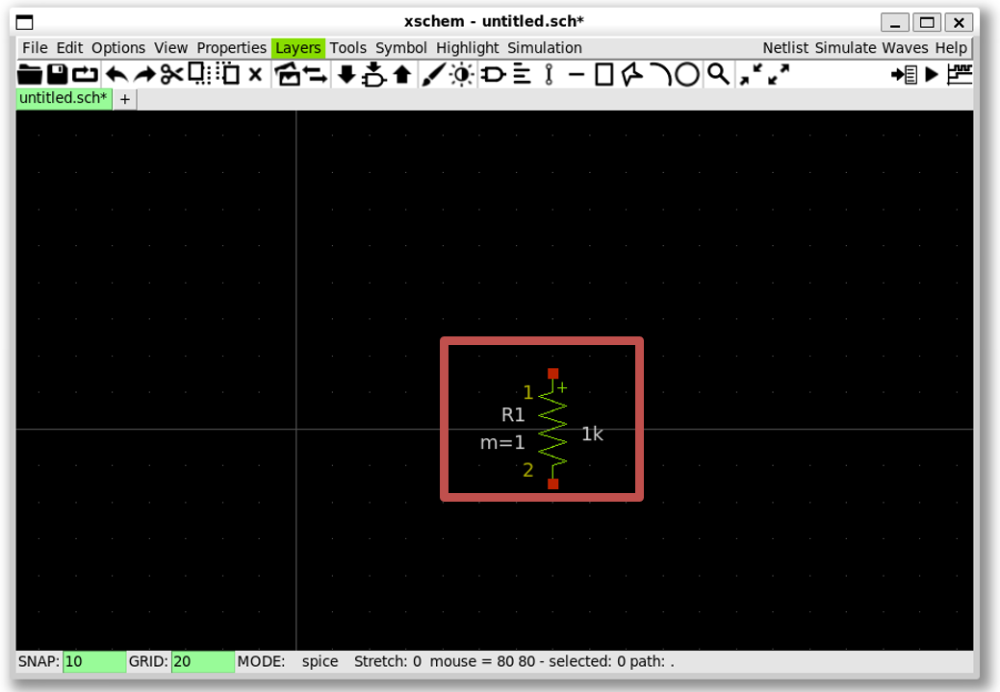
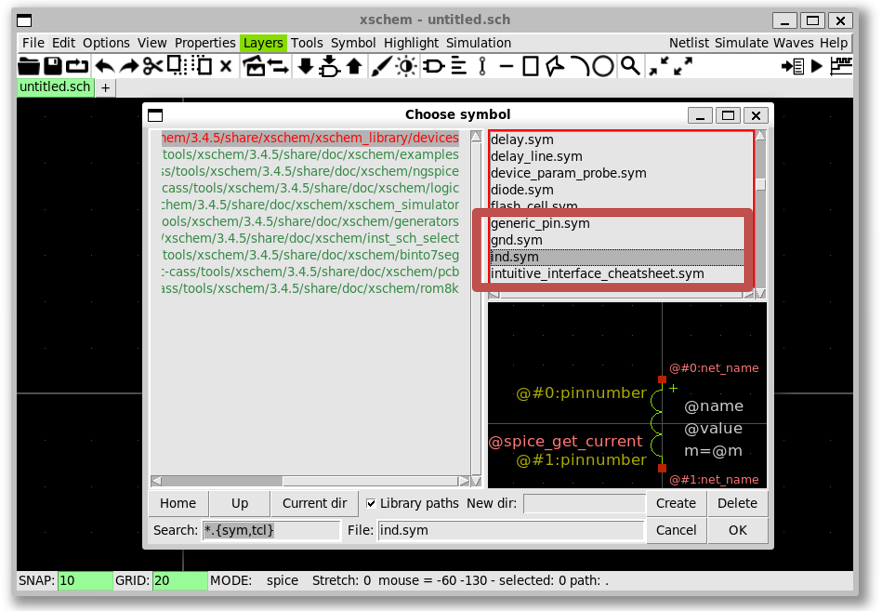
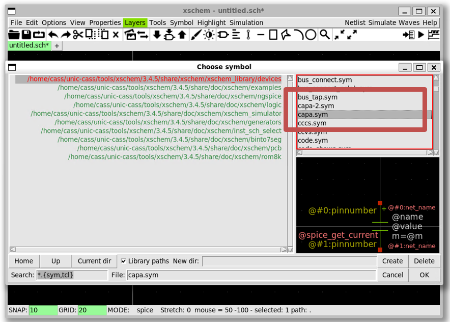
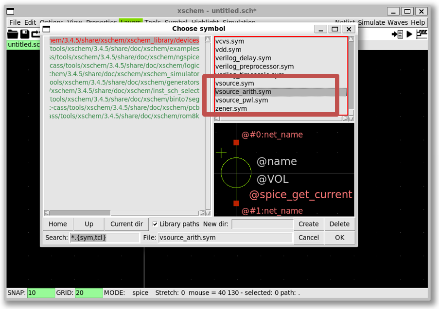

{: .no_toc }
# 2. Xscheme and NGSpice Demonstration

{: .no_toc }

<!-- <details open markdown="block">
  <summary>
    Table of contents
  </summary>
  {: .text-delta }
- TOC
{:toc}
</details> -->

This section demonstrates the usage of Xschem and NGSpice opensource tools.

## 2.1. Run Xscheme

- Open a Ubuntu 22.04 terminal and run the following commands (assuming that you already installed the tools):



```sh
$ source $HOME/unic-cass/env.sh
$ xschem
```

- The window pops up successfully as follows.



### Source

- [Xscheme Tutorial](https://xschem.sourceforge.io/stefan/xschem_man/tutorial_run_simulation.html).


## 2.2. Schematic capture - Create instances

Draw a RLC circuit in Xscheme:

- Create a new instance by selecting `Tools` >> `Insert Symbol` ``(Shift + i)``



- Create a resistor by `xscheme_library/devices` >> `res.sym` >> `OK` >> Click on the schematic windows





- Create an inductor (``ind.sym``)



- Create a capacitor (``capa.sym``)



- Create an arithmetic source (``vsource_arith.sym``)


