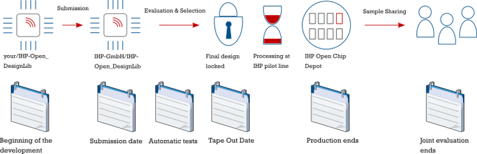
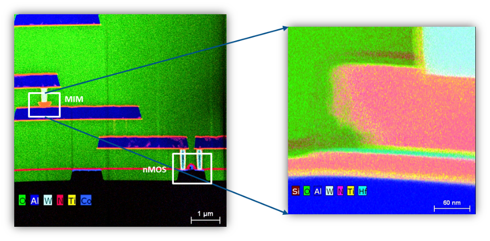
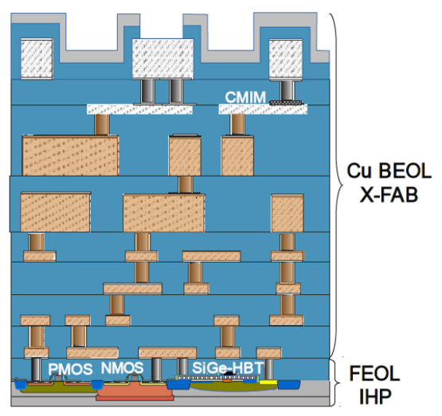

{: .no_toc }
# 3. IHP SG130 PDK Organization

{: .no_toc }

<!-- <details open markdown="block">
  <summary>
    Table of contents
  </summary>
  {: .text-delta }
- TOC
{:toc}
</details> -->

This section describes the organization of the IHP SG130 PDK


## 3.1. IHP-SG130 Open PDK

- Github repo: [Link](https://github.com/IHP-GmbH/IHP-Open-PDK/)

- PDK docs: [Link](https://ihp-open-pdk-docs.readthedocs.io/en/latest/index.html)

- Open libraries: [Link](https://github.com/IHP-GmbH/IHP-Open-DesignLib)

Tapeouts:

- November 2024: [Link](https://github.com/IHP-GmbH/TO_Apr2025)

- April 2025: [Link](https://github.com/IHP-GmbH/TO_Apr2025)

- Next tapeout: `September 2025`.



### Comparison Table

| **SiGe-HBT**           | SG13S              | SG13G2             | SG13G3Cu           |
|------------------------|--------------------|--------------------|--------------------|
| f<sub>T</sub> / f<sub>max</sub> | 250 / 340 GHz     | 350 / 450 GHz     | 470 / 650 GHz     |
| W<sub>Emitter</sub>    | 170 nm             | 130 nm             | 110 nm             |
| HBT BV<sub>CEO</sub>   | 1.7 V              | 1.6 V              | 1.5 V              |
| **CMOS node**          | **130 nm**         | **130 nm**         | **130 nm**         |
| Active devices         | Schottky diodes, Antenna diodes, PN diodes, ESD | Schottky diodes, Antenna diodes, PN diodes, ESD | Schottky diodes, Antenna diodes, PN diodes, ESD |
| Varactors              | NMOS Varactor      | NMOS Varactor      | NMOS Varactor      |
| Resistors              | Poly-Si, Thin Film | Poly-Si, Thin Film | Poly-Si            |
| MIM Caps               | 1.5 fF / µm² (Al), 2.1 fF / µm² (Cu) | 1.5 fF / µm² (Al), 2.1 fF / µm² (Cu) | 2.1 fF / µm²       |
| Metallization          | 7 Layers AL incl. 2 & 3 µm layers or *Cu: 4 + 2 (3µm), AL: 2 (3µm) | 7 Layers AL incl. 2 & 3 µm layers or *Cu: 4 + 2 (3µm), AL: 2 (3µm) | 7 Layers AL incl. 2 & 3 µm layers or *Cu: 4 + 2 (3µm), AL: 2 (3µm) | *Cu BEOL from X FAB

## 3.2. PDK Contents

### 3.2.1. PDK tech files for opensource tools

- DRC/LVS with KLayout

- DRC/Extraction with Magic

- Model files for Xyce / NgSpice

- Symbols for Xschem / Qucs-S

- Tech files for digital flow with OpenRoad

- Electromagnetic estimation with OpenEMS

### 3.2.2. IO Cells

### 3.2.3. Primitive cells’ layout

### 3.2.4. Single-port SRAM

### 3.2.5. Standard cells

- HV CMOS

- LV CMOS

```
.
├── sg13g2_io
│   ├── cdl
│   ├── doc
│   ├── gds
│   ├── lef
│   ├── lib
│   ├── spice
│   ├── verilog
│   └── xschem
├── sg13g2_pr
│   └── gds
├── sg13g2_sram
│   ├── cdl
│   ├── doc
│   ├── gds
│   ├── lef
│   ├── lib
│   └── verilog
└── sg13g2_stdcell
    ├── cdl
    ├── doc
    ├── gds
    ├── lef
    ├── lib
    ├── spice
    └── verilog
```

```
IHP-Open-PDK / ihp-sg13g2 / libs.tech
.
├── digital @ 9a6e7c9
├── klayout
├── magic
├── netgen
├── ngspice
├── openems
├── openroad
├── qucs
├── verilog-a
├── xschem
└── xyce/models
```

## 3.3. Transistor Structure & Metal Scheme

TEM cross section of 1T-1R Test strcture fabricated in 130m CMOS technology of IHP



- Metal scheme



## 3.4. Install the PDK (Manually)

Checkout the PDK:

```sh
$ git clone https://github.com/IHP-GmbH/IHP-Open-PDK
```

Install the required tools:

- Python 3.10.12

- openvaf 23.5.0

- ngspice 43

- Xyce 7.8-opensource

- xschem 3.4.5

- qucs-s s24.3.0 (12ddd12b)

- klayout 0.29.2

- openEMS v0.0.35-108-gc651cce

- magic 8.3.508

Build the simulation model 

```sh
$ cd ihp-sg13g2/libs.tech/xschem && ./install.py
```


