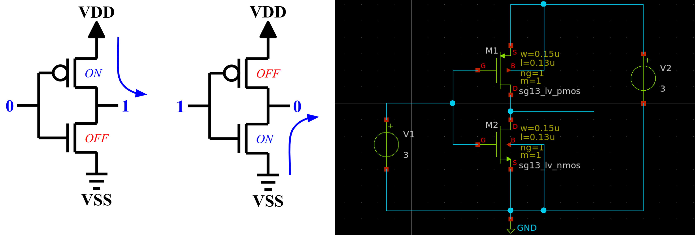
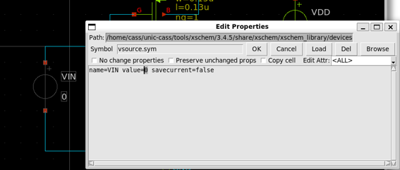
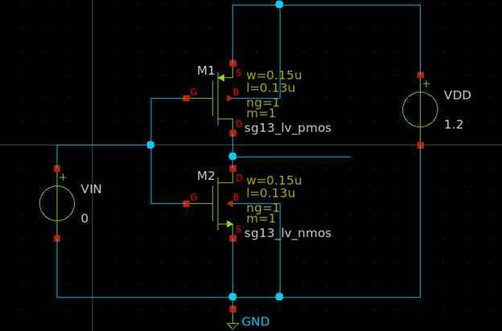
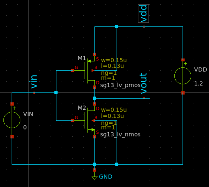
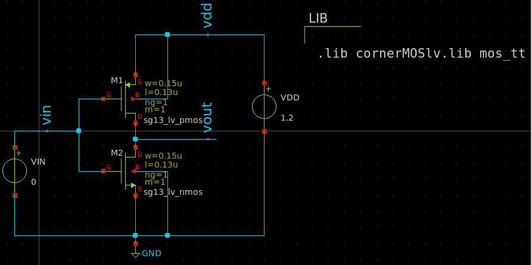
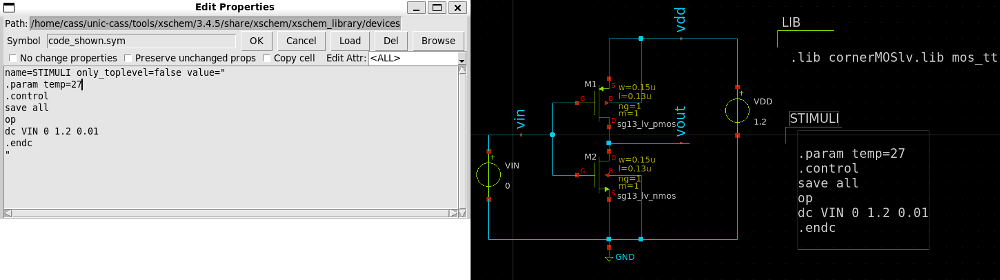
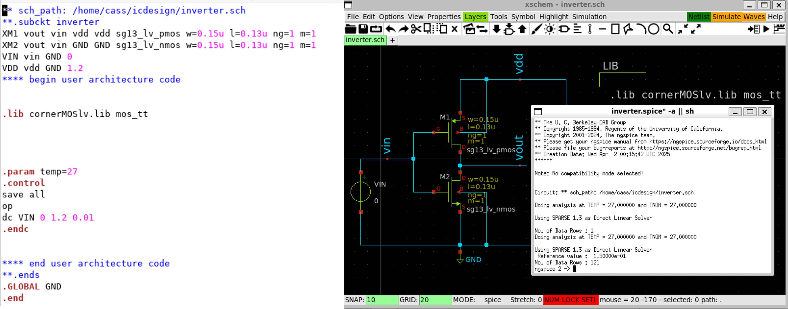
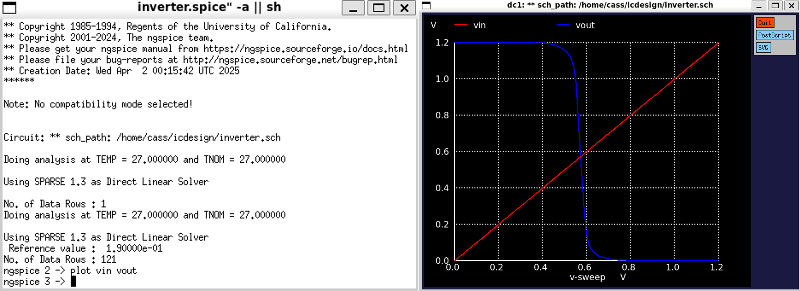
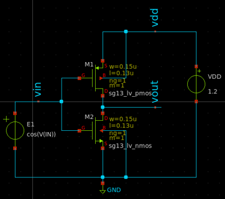
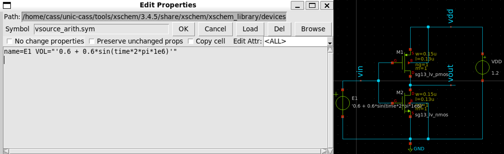

{: .no_toc }
# 5. Make an Inverter's Schematic and Simulation in Xscheme

{: .no_toc }

<!-- <details open markdown="block">
  <summary>
    Table of contents
  </summary>
  {: .text-delta }
- TOC
{:toc}
</details> -->

This section introduces an example how to make an inverter's schematic and simulate it.

## 5.1. Create an Inverter Schematic in Xscheme

This requires two transistors, PMOS and NMOS.

- M1: sg13_lv_pmos

- M2: sg13_lv_nmos

- V1, V2: vsource.sym

The overview schematic of an inverter is illustrated as follows.



## 5.2. Create the Power Supply and Input Signal

With the above schematic, change the voltage source as follows.

- Change `V1` into `VIN` with `value=0`

- Change `V2` into `VDD` with `value=1.2`



The final schematic is shown as follows.



## 5.3. Add the Lab Pins

- Create the lab pins for the input signal `vin` and the output signal `vout` by using the `lab_pin.sym`

- Similarly, create a lab pin for the power supply `vdd`



## 5.4. Setup the Library

- Use `cornerMOSlv.lib` and `mos_tt` section and insert a `code_shown.sym` into the schematic and modify its properties as follows.

```
.lib cornerMOSlv.lib mos_tt
```



## 5.5. Setup the Simulation

We need to sweep the `VGS` and `VDS` from `0` to `1.2V`.

- Insert a `code_shown.sym` and change its name into `STIMULI` and its properties as follows.

```
.param temp=27
.control
save all
op
dc VIN 0 1.2 0.01
.endc
```



## 5.6. Generate Netlist and Run the Simulation

- Click on `Netlist` button to generate the netlist

- Click on `Simulation` >> `Edit Netlist` to view the netlist

- Click on `Simulate` button to start the simulation



## 5.7. Plot the Waveform

- Plot the voltage of `vin` and `vout` by running the following command in `ngspice` shell:

```
plot vin vout
```



## 5.8. Modify the Circuit for AC Simulation

- Based on the schematic from the previous section, delete `VIN` symbol (select it, then press `delete` key)

- Insert `vsource_arithm.sym` and connect the wires, respectively.



- Change `E1` source's properties as follows.


