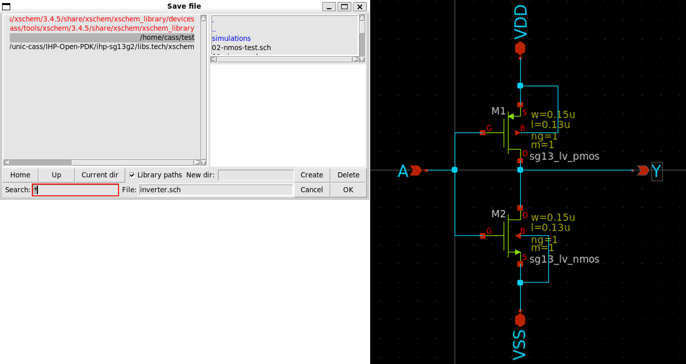

{: .no_toc }
#  6. Create the Inverter's Subcircuit and Symbol in Xscheme

{: .no_toc }

<!-- 

  

    Table of contents
  

  {: .text-delta }
- TOC
{:toc}

 -->

This section introduces how to create the inverter as a subcircuit and make its symbol with Xscheme.

## 6.1. Inverter as Subcircuit

Create an inverter schematic in Xcheme

- Input: `A` (`ipin.sym`)

- Output: `Y` (`opin.sym`)

- Power supply: `VDD` (`iopin.sym`)

- Ground: `VSS` (`iopin.sym`)

Save the schematic by selecting `File` >> `Save As` >> `inverter.sch`

Next, we create the symbol for the inverter.
