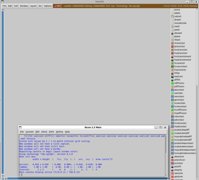
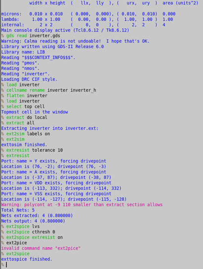

{: .no_toc }
# 8. Parasitic Extraction with Magic

{: .no_toc }

<!-- <details open markdown="block">
  <summary>
    Table of contents
  </summary>
  {: .text-delta }
- TOC
{:toc}
</details> -->

This section shows how to extract parasitic of the layout with `Magic`.

## 8.1. Extraction using Magic

- Run the `Magic` with the technology file from `IHP-SG13G2` in the same folder with `inverter.gds`

```sh
$ source $HOME/unic-cass/env.sh
$ magic -rcfile ~/unic-cass/IHP-Open-PDK/ihp-sg13g2/libs.tech/magic/ihp-sg13g2.magicrc
```



- Run the following commands in the `Magic` shell

```tcl
% gds read inverter.gds
% load inverter
% cellname rename inverter inverter_h
% flatten inverter
% load inverter
% select top cell
% extract do local
% extract all
% ext2sim labels on
% ext2sim
% extresist tolerance 10
% extresist
% ext2spice lvs
% ext2spice cthresh 0
% ext2spice extresist on
% ext2spice
```

- A new `inverter.spice` will be extracted




